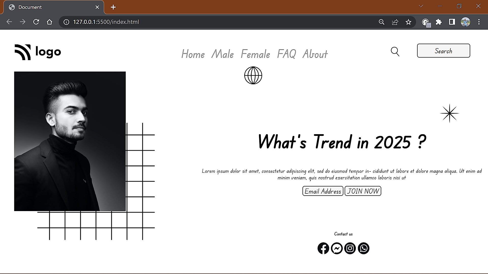

# ASSIGNMENT 1 USING HTML AND CSS

## NAME : NIRAJ VADHER 

In the very first project I was given the task to make a home page which should look like this

### Target:

### Result:

`ZOOM:67%`
## Learning
In this project i get to learn many thing like
- How to create a navbar
- how to align Text
- how to change Font-family
- how to overlap images using z-index

## Honest Time of compeletion of project
- `7 hours`

## Live link of project
 - [PROJECT 1](https://tempproject1.netlify.app/)